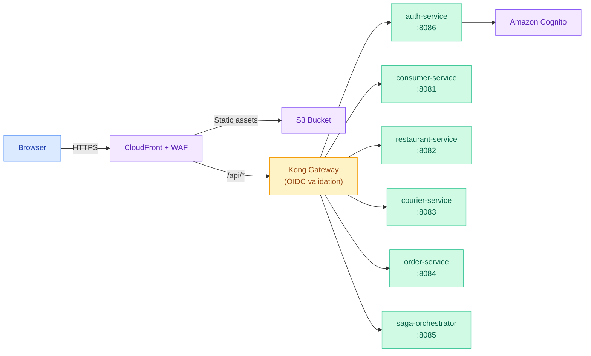
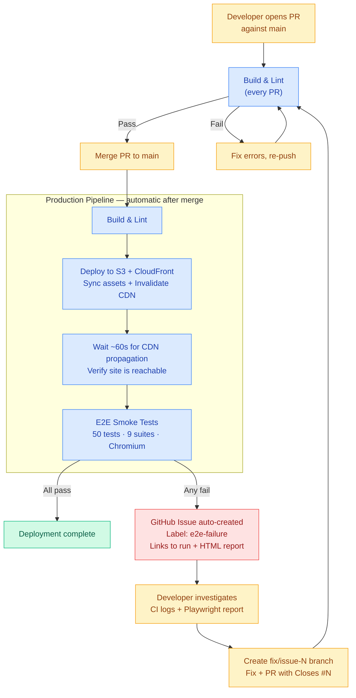
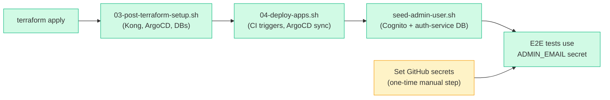

# MunchGo SPA

React 19 + TypeScript + Vite single-page application for the MunchGo food delivery platform. This SPA replaces the monolith's Thymeleaf frontend and connects to 6 microservices via the Kong API Gateway.

## Architecture



**Traffic path:** Browser → CloudFront + WAF → S3 (static) or Kong (API) → Istio Gateway → Microservices

## Tech Stack

| Layer | Technology |
|-------|-----------|
| **Framework** | React 19, TypeScript, Vite 7 |
| **Styling** | Tailwind CSS 4 |
| **Routing** | React Router 7 |
| **HTTP Client** | Axios |
| **Auth** | Amazon Cognito (JWT) — OIDC validated at Kong |
| **Hosting** | S3 + CloudFront + WAF |
| **API Gateway** | Kong Cloud Gateway |
| **E2E Testing** | Playwright (Chromium) |
| **CI/CD** | GitHub Actions → S3 → CloudFront invalidation |

## Project Structure

```
munchgo-spa/
├── src/
│   ├── api/                  # API client layer (one file per microservice)
│   │   ├── auth.ts           # Login, register, profile (auth-service)
│   │   ├── client.ts         # Axios instance with JWT interceptor
│   │   ├── consumers.ts      # Consumer profiles (consumer-service)
│   │   ├── couriers.ts       # Courier management (courier-service)
│   │   ├── orders.ts         # Order CRUD (order-service)
│   │   ├── restaurants.ts    # Restaurant & menu (restaurant-service)
│   │   └── sagas.ts          # Order placement saga (saga-orchestrator)
│   ├── auth/                 # Authentication context & hooks
│   │   ├── AuthContext.tsx    # AuthProvider — login, register, logout, token refresh
│   │   ├── context.ts        # React context definition
│   │   └── useAuth.ts        # useAuth() hook
│   ├── components/           # Shared UI components
│   │   ├── OrderTimeline.tsx  # Order state progression visualisation
│   │   ├── Spinner.tsx        # Loading spinner
│   │   └── StatusBadge.tsx    # Order status pill badges
│   ├── config/
│   │   └── api.ts            # API gateway URL config (VITE_API_GATEWAY_URL)
│   ├── pages/                # Route-level page components
│   │   ├── Home.tsx           # Landing page (hero + feature cards)
│   │   ├── Login.tsx          # Login form (email + password)
│   │   ├── Register.tsx       # Registration form (role tabs)
│   │   ├── admin/             # Admin panel (dashboard, consumers, restaurants, orders, couriers)
│   │   ├── courier/           # Courier dashboard (available pickups, active deliveries)
│   │   ├── customer/          # Customer pages (dashboard, restaurants, menu, orders, order detail)
│   │   └── restaurant/        # Restaurant owner dashboard (order workflow states)
│   ├── types/
│   │   └── index.ts           # Shared TypeScript interfaces
│   ├── App.tsx                # Root component — routes, navbar, RequireAuth wrapper
│   └── main.tsx               # Entry point
├── public/
│   └── xray-assessment/       # Static App X-Ray Assessment report
├── e2e/                       # Playwright E2E test suite
│   ├── tests/                 # 9 test suites (50 tests)
│   │   ├── helpers/auth.ts    # Test user generation, register/login helpers
│   │   └── video/             # 4 video showcase tests for recording
│   ├── scripts/
│   │   └── collect-videos.mjs # Collects .webm recordings into demo-videos/
│   ├── playwright.config.ts       # Main test config (excludes video tests)
│   └── playwright.video.config.ts # Video recording config (slowMo, only video tests)
└── .github/workflows/
    └── deploy.yml             # CI/CD pipeline (build → deploy → E2E)
```

## Routing

```mermaid
graph TD
    classDef pub fill:#dbeafe,stroke:#3b82f6
    classDef auth fill:#fef3c7,stroke:#f59e0b
    classDef admin fill:#fee2e2,stroke:#ef4444

    R["/"]:::pub --> Home["Home Page"]
    R1["/login"]:::pub --> Login["Login"]
    R2["/register"]:::pub --> Register["Register"]
    R3["/customer/restaurants"]:::pub --> Restaurants["Browse Restaurants"]
    R4["/customer/restaurants/:id/menu"]:::pub --> Menu["Restaurant Menu"]
    R5["/customer/dashboard"]:::auth --> CustDash["Customer Dashboard"]
    R6["/customer/orders"]:::auth --> Orders["My Orders"]
    R7["/customer/orders/:id"]:::auth --> Detail["Order Detail"]
    R8["/restaurant/dashboard"]:::auth --> RestDash["Restaurant Dashboard"]
    R9["/courier/dashboard"]:::auth --> CourDash["Courier Dashboard"]
    R10["/admin"]:::admin --> AdminDash["Admin Dashboard"]
    R11["/admin/consumers"]:::admin --> AdminCon["Consumers Table"]
    R12["/admin/restaurants"]:::admin --> AdminRes["Restaurants Table"]
    R13["/admin/orders"]:::admin --> AdminOrd["Orders Table"]
    R14["/admin/couriers"]:::admin --> AdminCou["Couriers Table"]
```



**Legend:** Blue = public, Yellow = requires login, Red = admin only

## UI Parity with Monolith

The SPA maintains content parity with the monolith Thymeleaf templates. All page headings, button labels, navigation links, feature card titles, and form element text match the monolith exactly. Only styling and technology differ (TailwindCSS vs Bootstrap, React Router vs server-side rendering, JWT vs session auth).

Known intentional differences (driven by the modernised architecture):

- **Login uses email** instead of username (Cognito identity provider)
- **Register uses role tabs** instead of a dropdown select
- **SPA auto-logs-in** after registration (no redirect to `/login?registered`)
- **No "Remember me" checkbox** (JWT-based auth handles persistence)
- **No admin/users page** (users managed via Cognito console, not DB)
- **No dedicated 403 page** (RequireAuth redirects to `/login`)
- **Order cancel** allowed for APPROVAL_PENDING + APPROVED (monolith: APPROVED only)

The E2E test suite includes a dedicated **UI parity test** (`e2e/tests/09-ui-parity.spec.ts`) that validates content alignment across all pages.

## Development

```bash
npm install
npm run dev          # Start dev server (http://localhost:5173)
npm run build        # Production build → dist/
npm run lint         # ESLint check
```

Override the API gateway for local development:

```bash
# .env.development
VITE_API_GATEWAY_URL=http://localhost:8080
```

## CI/CD Pipeline

Every merge to `main` triggers a three-stage automated pipeline. Pull requests run only **Build & Lint** for fast feedback.



| Step | Trigger | Responsible |
|------|---------|-------------|
| Build & Lint | Every PR + push to `main` | Automatic |
| Deploy to S3 + CloudFront | Push to `main` only | Automatic |
| Wait for CDN propagation | After deploy | Automatic |
| E2E Smoke Tests | After CDN ready | Automatic |
| Auto-create GitHub Issue | When any E2E test fails | Automatic |
| Investigate & fix | After issue notification | Developer |
| Close GitHub Issue | After fix PR merged (via `Closes #N`) | Automatic |

### Auto-Created Issues on E2E Failure

When any E2E test fails after a production deploy, the pipeline automatically opens a GitHub issue containing:

- Commit SHA and branch that triggered the failure
- Direct link to the failing workflow run
- Link to the `playwright-report` artifact (HTML report + video recordings, retained 14 days)
- Label `e2e-failure` for easy filtering

### Developer Fix Workflow

1. **Investigate** — Download the `playwright-report` artifact from the workflow run. Open `index.html` to see failed tests, error messages, screenshots, and video recordings.

2. **Branch** — `git checkout -b fix/issue-N` from `main`.

3. **Fix** — Common root causes:
   - Strict mode violation → scope locator with `.first()`, `getByRole('heading')`, or `getByRole('navigation')`
   - Assertion timeout → add `{ timeout: 10_000 }` to the assertion
   - App regression → fix the source code

4. **PR** — Include `Closes #N` in the PR body. Merge when CI is green.

5. **Confirm** — The full pipeline re-runs. If E2E passes, the issue auto-closes.

## E2E Test Suite

Tests run against the live CloudFront deployment using Playwright (Chromium). The suite validates registration, login, browsing, ordering, dashboards, admin panel, and UI parity with the monolith.

```mermaid
graph LR
    classDef pass fill:#d1fae5,stroke:#10b981
    classDef skip fill:#fef3c7,stroke:#f59e0b
    classDef fail fill:#fee2e2,stroke:#ef4444

    S1["01 Registration\n6 tests"]:::pass --> S2["02 Login/Logout\n5 tests"]:::pass
    S2 --> S3["03 Browse\n7 tests"]:::pass
    S3 --> S4["04 Order Placement\n3 tests"]:::fail
    S4 --> S5["05 Order Lifecycle\n1 test"]:::skip
    S5 --> S6["06 Order Cancel\n1 test"]:::skip
    S6 --> S7["07 Admin\n7 tests"]:::pass
    S7 --> S8["08 Role Dashboards\n6 tests"]:::pass
    S8 --> S9["09 UI Parity\n14 tests"]:::pass
```



| File | Suite | Tests | Status |
|------|-------|-------|--------|
| `01-registration.spec.ts` | Customer, owner, courier registration | 6 | Active |
| `02-login-logout.spec.ts` | Login, logout, invalid credentials | 5 | Active |
| `03-browse.spec.ts` | Guest browsing, menu, prices, cart prompt | 7 | Active |
| `04-order-placement.spec.ts` | Place order, view in orders list | 3 | Active* |
| `05-order-lifecycle.spec.ts` | Owner approval & status progression | 1 | Skipped** |
| `06-order-cancel.spec.ts` | Customer cancels approved order | 1 | Skipped** |
| `07-admin.spec.ts` | Admin dashboard, consumers, restaurants, orders, couriers | 7 | Active |
| `08-role-based-dashboards.spec.ts` | Customer, owner, courier dashboards | 6 | Active |
| `09-ui-parity.spec.ts` | Content alignment with monolith | 14 | Active |

> \* 2 order placement tests may fail due to Kafka consumer-events propagation timing — the saga's `VALIDATE_CONSUMER` step returns 404 when consumer-service hasn't processed the registration event yet. This is a backend timing issue, not a test issue.
>
> \*\* Requires a restaurant owner pre-linked to a seeded restaurant. New registrations use a placeholder `restaurantId` and are never linked to seeded restaurants.

### Running Tests Locally

```bash
cd e2e
npm install
npx playwright install --with-deps chromium

npx playwright test              # Headless (all 50 tests)
npx playwright test --ui         # Interactive UI mode
npx playwright show-report       # View HTML report after a run

# Override target environment
BASE_URL=http://localhost:5173 npx playwright test
```

### Video Recording

The suite includes 4 video showcase tests that record watchable demonstrations of the full application flow.

```bash
npm run test:video               # Record showcase videos (with slowMo)
npm run test:video:headed        # Watch live while recording
npm run video:collect            # Collect .webm files into demo-videos/
```

The 4 showcase videos cover:

| # | Video | What it shows |
|---|-------|--------------|
| 1 | Home & Guest Browsing | Landing page → features → browse restaurants → menu → guest prompt |
| 2 | Customer Journey | Register → dashboard → browse → add items → delivery address → place order |
| 3 | Role Dashboards | Restaurant owner registration + dashboard → courier registration + dashboard |
| 4 | Admin Panel | Admin login → dashboard cards → consumers → restaurants → orders → couriers |

To merge all recordings into a single video:
```bash
ffmpeg -f concat -safe 0 \
  -i <(for f in demo-videos/*.webm; do echo "file '$(pwd)/$f'"; done) \
  -c copy demo-videos/munchgo-e2e-showcase.webm
```

## Static Pages

Static HTML pages in `public/` are served as-is by Vite (dev) and CloudFront (production):

| Path | Description |
|------|-------------|
| `/xray-assessment` | App X-Ray Assessment report — interactive HTML with scoring, Mermaid diagrams, and modernisation recommendations |

To add more static pages, create `public/<page-name>/index.html`. The deploy pipeline handles them with no-cache headers.

## Pipeline Configuration

The workflow is defined in `.github/workflows/deploy.yml`. Required GitHub repository secrets and variables:

| Name | Type | Description |
|------|------|-------------|
| `AWS_ROLE_ARN` | Secret | IAM role ARN for OIDC federation |
| `AWS_REGION` | Secret | AWS region (e.g. `ap-southeast-2`) |
| `SPA_BUCKET_NAME` | Secret | S3 bucket name for SPA hosting |
| `CLOUDFRONT_DISTRIBUTION_ID` | Secret | CloudFront distribution ID for cache invalidation |
| `ADMIN_EMAIL` | Secret | Admin user email for E2E tests (`admin@munchgo.com`) |
| `ADMIN_PASSWORD` | Secret | Admin user password for E2E tests |
| `CLOUDFRONT_URL` | Variable | CloudFront URL for E2E tests (optional — falls back to hardcoded default) |

### Admin User Seeding

The admin user (`admin@munchgo.com`) must exist in **both** Amazon Cognito **and** the auth-service PostgreSQL database. This is handled by `seed-admin-user.sh` in the infrastructure repo:



If admin E2E tests are skipping, verify:
1. `ADMIN_EMAIL` and `ADMIN_PASSWORD` GitHub secrets are set
2. `seed-admin-user.sh` has been run (creates admin in Cognito + auth-service DB)

## PR & Branch Conventions

| Rule | Detail |
|------|--------|
| **Never commit directly to `main`** | Always work in a branch and open a PR |
| **Branch naming** | `fix/<description>` · `feat/<description>` · `chore/<description>` |
| **Link issues** | Always include `Closes #N` in the PR body |
| **Draft PRs** | Use draft status for work in progress; only merge when CI is green |
