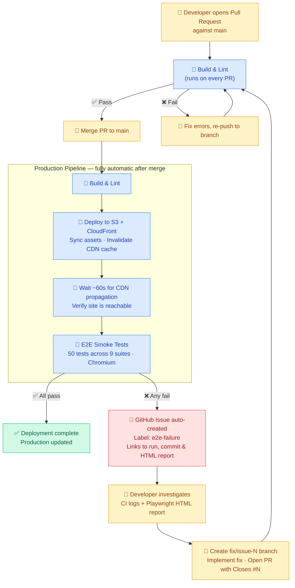

# MunchGo SPA

React + TypeScript + Vite single-page application for the MunchGo food delivery platform. This SPA replaces the monolith Thymeleaf frontend and connects to microservices via an API gateway.

## UI Parity with Monolith

The SPA maintains content parity with the monolith Thymeleaf templates. All page headings, button labels, navigation links, feature card titles, and form element text match the monolith exactly. Only styling and technology differ (TailwindCSS vs Bootstrap, React Router vs server-side rendering, JWT vs session auth).

Known intentional differences (driven by the modernised architecture):

- **Login uses email** instead of username (Cognito identity provider)
- **Register uses role tabs** instead of a dropdown select
- **SPA auto-logs-in** after registration (no redirect to `/login?registered`)
- **No "Remember me" checkbox** (JWT-based auth handles persistence)
- **No admin/users page** (users managed via Cognito console, not DB)
- **No dedicated 403 page** (RequireAuth redirects to `/login`)
- **Order cancel** allowed for APPROVAL_PENDING + APPROVED (monolith: APPROVED only)

The E2E test suite includes a dedicated **UI parity test** (`e2e/tests/09-ui-parity.spec.ts`) that validates content alignment across all pages.

## Tech Stack

- **Framework:** React 19 + TypeScript
- **Build:** Vite
- **Auth:** Amazon Cognito (JWT)
- **Hosting:** S3 + CloudFront + WAF
- **API Gateway:** Kong

## Development

```bash
npm install
npm run dev          # Start dev server (http://localhost:5173)
npm run build        # Production build → dist/
npm run lint         # ESLint check
```

## CI/CD & Developer Workflow

This section explains the automated deployment pipeline, how E2E failures are automatically surfaced as GitHub issues, and the process developers follow to investigate and resolve them.

### The Automated CI/CD Pipeline

Every merge to `main` triggers a three-stage automated pipeline. Pull requests against `main` run only **Build & Lint** — giving fast feedback before any code reaches production.



| Step | Runs on | Responsible |
|------|---------|-------------|
| Build & Lint | Every PR + every push to `main` | 🤖 Automatic |
| Deploy to S3 + CloudFront | Push to `main` only (not PRs) | 🤖 Automatic |
| Wait for CDN propagation | After deploy | 🤖 Automatic |
| E2E Smoke Tests | After CDN propagation | 🤖 Automatic |
| Auto-create GitHub Issue | When any E2E test fails | 🤖 Automatic |
| Investigate & fix | After issue notification | 👤 Developer |
| Open Pull Request | After implementing fix | 👤 Developer |
| Merge PR | After CI passes on PR | 👤 Developer |
| Close GitHub Issue | After PR merge (via `Closes #N`) | 🤖 Automatic |

### How Issues Are Auto-Created

When any E2E test fails after a production deploy, the pipeline automatically opens a GitHub issue containing:

- Commit SHA and branch that triggered the failure
- Direct link to the failing workflow run
- Link to the `playwright-report` artifact (Playwright HTML report + video recordings, retained for 14 days)
- Label `e2e-failure` for easy filtering

You will receive an email notification if you are watching the repository.

### Developer Fix Workflow

When you receive an `e2e-failure` issue:

1. **Investigate** — Click the workflow run link in the issue body. Download the `playwright-report` artifact and open `index.html` to see exactly which tests failed, the error messages, and video recordings.

2. **Create a branch** — Always branch from `main`:
   ```bash
   git checkout main && git pull
   git checkout -b fix/issue-N
   ```

3. **Implement the fix** — Common root causes:
   - Strict mode violation: a locator matched multiple elements → add `.first()` or a more specific selector
   - Assertion timeout: spinner was still visible → add `{ timeout: 10_000 }` to the assertion
   - App regression: a code change broke behaviour → fix the source code

4. **Open a Pull Request** — Include `Closes #N` in the PR body. GitHub uses this to auto-close the issue on merge.

5. **Wait for CI** — Build & Lint runs automatically on your PR branch. Fix any errors before merging.

6. **Merge** — Once CI is green, merge the PR. The full production pipeline (Build → Deploy → E2E) re-runs on `main` automatically.

7. **Confirm** — If all E2E tests pass, the linked issue closes automatically. If tests still fail, a new issue is created for the next cycle.

### PR & Branch Conventions

| Rule | Detail |
|------|--------|
| **Never commit directly to `main`** | Always work in a branch and open a PR |
| **Branch naming** | `fix/<description>` · `feat/<description>` · `chore/<description>` |
| **Link issues** | Always include `Closes #N` in the PR body |
| **Draft PRs** | Use draft status for work in progress; only merge when CI is green |

### E2E Test Suite

Tests run against the live CloudFront deployment using Playwright (Chromium).

| File | Suite | Status |
|------|-------|--------|
| `01-registration.spec.ts` | Customer & owner registration | ✅ Active |
| `02-login-logout.spec.ts` | Login and logout | ✅ Active |
| `03-browse.spec.ts` | Restaurant and menu browsing | ✅ Active |
| `04-order-placement.spec.ts` | Full order placement + detail view | ✅ Active |
| `05-order-lifecycle.spec.ts` | Owner approval & status progression | ⏭ Skipped* |
| `06-order-cancel.spec.ts` | Customer cancels an approved order | ⏭ Skipped* |
| `07-admin.spec.ts` | Admin dashboard | ⏭ Skipped** |
| `08-role-based-dashboards.spec.ts` | Customer / owner / courier dashboards | ✅ Active |
| `09-ui-parity.spec.ts` | Content parity with monolith | ✅ Active |

> \* Requires a restaurant owner account pre-linked to a seeded restaurant. The current MVP uses `user.userId` as a placeholder `restaurantId` in `RestaurantDashboard.tsx` — new registrations are never linked to seeded restaurants so the Approve button never appears.
>
> \*\* Requires `ADMIN_EMAIL` and `ADMIN_PASSWORD` GitHub secrets to be configured. Tests are skipped when these are absent.

To run tests locally against the live deployment:

```bash
cd e2e
npm install
npx playwright install --with-deps chromium
npx playwright test              # Headless
npx playwright test --ui         # Interactive UI mode
npx playwright show-report       # View HTML report after a run
```

Override the target environment:

```bash
BASE_URL=http://localhost:5173 npx playwright test
```

### Pipeline Configuration

The workflow is defined in `.github/workflows/deploy.yml`. The following GitHub repository secrets and variables must be configured:

| Name | Type | Description |
|------|------|-------------|
| `AWS_ROLE_ARN` | Secret | IAM role ARN for OIDC federation |
| `AWS_REGION` | Secret | AWS region (e.g. `ap-southeast-2`) |
| `SPA_BUCKET_NAME` | Secret | S3 bucket name for SPA hosting |
| `CLOUDFRONT_DISTRIBUTION_ID` | Secret | CloudFront distribution ID for cache invalidation |
| `ADMIN_EMAIL` | Secret | Email of the admin user for admin E2E tests |
| `ADMIN_PASSWORD` | Secret | Password of the admin user for admin E2E tests |
| `CLOUDFRONT_URL` | Variable (optional) | CloudFront URL for E2E tests (falls back to hardcoded default if unset) |
