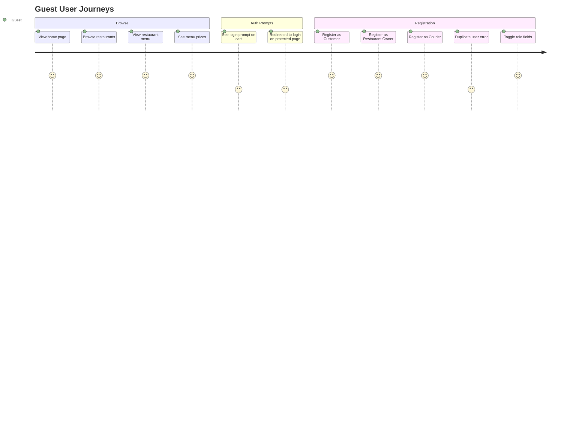
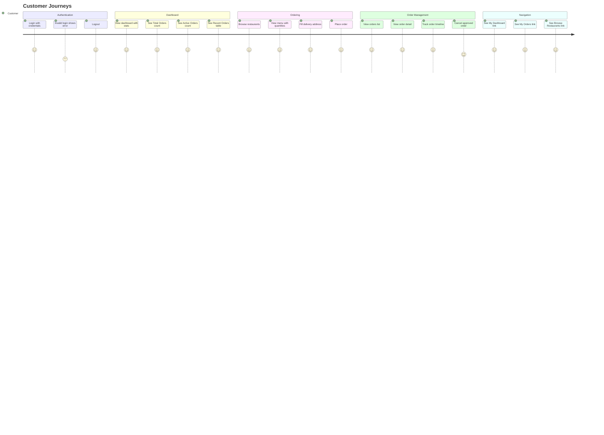
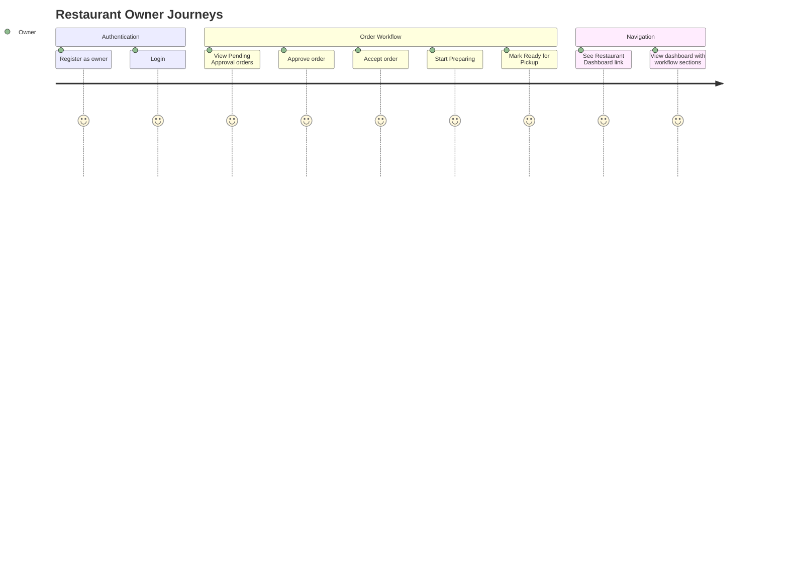
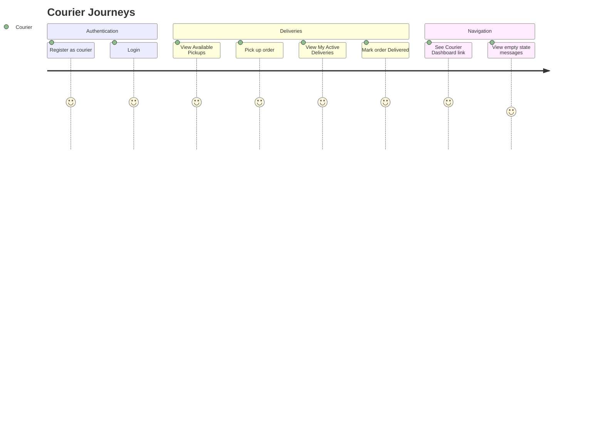
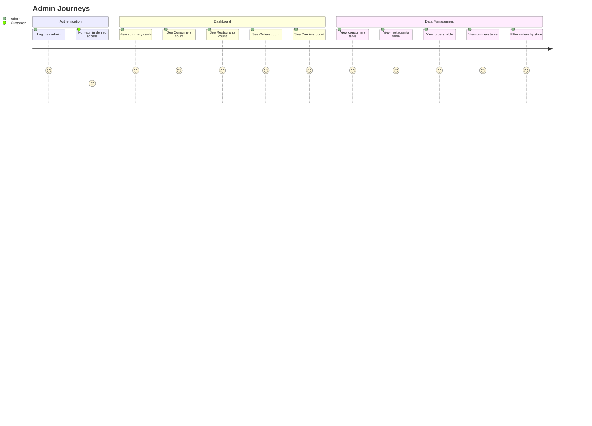
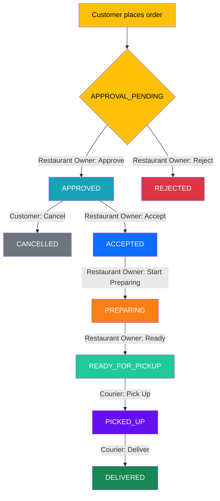

# MunchGo E2E User Journeys

This document maps every user journey covered by the E2E test suites for both the **Monolith** (Playwright against localhost:8080) and the **SPA** (Playwright against CloudFront). Both suites test the same journeys to validate functional parity.

---

## Journey Coverage by Role

### Guest User

### Customer

### Restaurant Owner

### Courier

### Admin

---

## Order Lifecycle State Machine

This is the core cross-role journey tested in `05-order-lifecycle.spec.ts`:

---

## Test File to Journey Mapping

| Test File | Journeys Covered | Roles | Monolith | SPA |
|-----------|-----------------|-------|----------|-----|
| `01-registration` | Registration for all 3 roles, duplicate error, field toggling | Guest | 5 tests | 6 tests |
| `02-login-logout` | Login, invalid login, logout, auth redirect | Guest, Customer, Admin | 6 tests | 5 tests |
| `03-browse` | Home page, restaurant browsing, menu viewing, guest prompts | Guest, Customer | 4 tests | 7 tests |
| `04-order-placement` | Place order, verify in list, view detail | Customer | 3 tests | 3 tests |
| `05-order-lifecycle` | Full order state machine across all roles | All 4 roles | 1 test | 1 test |
| `06-order-cancel` | Cancel approved order | Customer, Owner | 1 test | 1 test |
| `07-admin` | Dashboard, all admin tables, access denial | Admin, Customer | 7 tests | 7 tests |
| `08-role-based-dashboards` | Dashboard routing, navbar links per role | All 4 roles | 4 tests | 6 tests |
| `09-ui-parity` | Content parity validation across all pages | All roles | — | 14 tests |
| **Total** | | | **31 tests** | **50 tests** |

---

## Intentional Differences (Not Bugs)

These are architecture-driven differences between monolith and SPA that are documented and tested:

| Area | Monolith | SPA | Reason |
|------|----------|-----|--------|
| Login field | Username | Email | Cognito identity provider |
| Role selection | Dropdown `<select>` | Tab buttons | Modern UX pattern |
| Post-registration | Redirect to `/login?registered` | Auto-login to dashboard | Better UX, JWT-based |
| Remember me | Checkbox present | Not present | JWT handles persistence |
| Admin Users page | Present | Absent | Users managed via Cognito console |
| 403 page | Dedicated error page | Redirect to `/login` | SPA uses RequireAuth component |
| Cancel eligibility | APPROVED only | APPROVAL_PENDING + APPROVED | Broader cancel window |
| Order state filters | None | Filter pills on admin orders | SPA enhancement |
| Pagination | None | Present on order lists | SPA enhancement |
